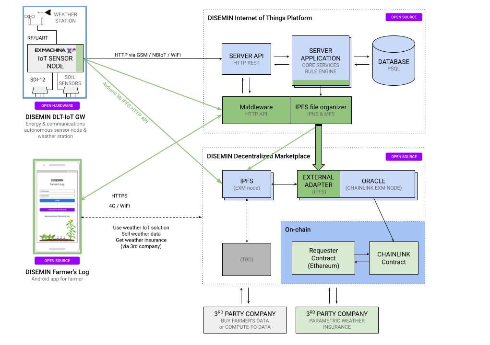

## DISEMIN

DISEMIN project aspires to build a DLT enabled IoT solution that addresses typical precision agriculture requirements, with open source technologies and emphasis on data sovereignty. Farmer uses a mobile application to visualize crop & weather data produced via our DLT compatible IoT sensor node hardware, making sensor data directly accessible to blockchain smart contracts, enabling services such as parametric weather crop insurance or data sales to be conducted in an economic and trustless manner.

## Core components

1. **IoT sensor node** for field deployment
2. **IoT PaaS** admin backend and optional end-user front-end
3. **Middleware for IoT PaaS** API abstraction and enhancement 
4. **Middleware for IPFS** file organizing and **CHAINLINK** oracle adapter
5. **Android mobile application** front-end for the end user / farmer
6. **Web application** front-end for the end user / farmer

## Architecture

## 1. IoT sensor node

[EXM-IoT-Node](https://github.com/exmgr/EXM-IoT-Node) is an energy and communication autonomous IoT sensor node with weather sensors, that stores sensor data directly to IPFS and automates execution of parametric weather insurance contracts on-chain via the distributed chainlink oracle system.

### 1.1 Node Features

- Energy autonomous (2W solar power and 2x18650 Lithium batteries)  
- Communication autonomous, global roaming (GPS/GSM/LTE/NBIoT/LoRa/WiFi/BLE).
- Supports plethora of environmental sensors (SDI-12, UART, RF) such as water quality, air quality, noise, soil moisture and weather stations
- 3D printable, weatherproof enclosure with modular mounting options
- Telemetry and powerful device management via Thingsboard
- Stores (adds) sensor data (e.g weather conditions) directly to IPFS
- complemented by EXM IPFS middleware to improve file organization and discoverability (IPNS & MFS)

### 1.2 Hardware Sensor Node setup
NOTE: firmware/include/boards/ allows for re-wiring pins to a different ESP32 hardware module. Core functionality (i.e. all feature flags set to false) should work on any ESP32 hardware connected over WiFi but its complicated to support multiple board's GSM/LoRa modules, thus we only support our hardware for now.

#### 1.2.1 Firmware high level instructions

The preparation of the EXM IoT sensor node for deployment consists of the following steps:

1. Configure and flash firmware
    1.  Set up credentials
    2.  Set up app config flags
    3.  Build and Flash
2. Create a Thingsboard device and copy it's access token
3. Boot the physical device in config mode and set a. the Thingsboard device `access token` and b. the cellular network `APN`

More details in the [firmware](https://github.com/exmgr/exm-iot-node-firmware) repo.

#### 1.2.2 IPFS related firmware setup

The IPFS firmware flag has to be set to `true` in order to submit weather data to an IPFS node.

Configure `IPFS_NODE_ADDR` and `IPFS_MIDDLEWARE_URL` in the `credentials.h.template` and rename it to `credentials.h`.

Node is using geohash to describe location when adding sensor data to IPFS. A geohash is a convenient way of expressing a location (i.e lat/lon) using a short alphanumeric string, with greater precision obtained with longer strings. https://en.wikipedia.org/wiki/Geohash

Use of geohashes was been chosen to assist with data discoverability identifying the nearest available weather station / weather data source.

#### 1.2.3 IPFS ESP32 Arduino Library

IPFS, being a novel web 3.0 open-source technology, did not have libraries for microcontrollers (e.g. Arduino ESP32 etc) therefore we developed this library and published as a standalone Arduino ESP32 library, made available also in https://platformio.org.

#### 1.2.4 Remote device management

A powerful device management takes place via thingsboard "shared attributes" controlled by a custom thingsboard widget. This approach enables for user-friendly remote device filesystem format, reboot, rtc sync, sensor on/off, and firmware OTA.

## 2. IoT PaaS

[Thingsboard](https://github.com/thingsboard/thingsboard) is used as the core of the admin backend and (optional) end-user front-end. All sensor telemetry, and customer entities are defined here. This includes customer credentials, abstract assets such as farms, devices etc.  

Custom widgets and rules extend the functionality of thinsboard to enhance the communication with the hardware node and achieve project goals. 

More details in the [thingsboard-assets](https://github.com/exmgr/exm-iot-node-thingsboard-assets) repo.

## 3. IoT PaaS middleware

To extent Thingsboard's functionality, a Java Sprint middleware has been developed in order to:

- Manage the lifecycle of the Thingsboard entities
- Overcome some of the Thingsboard's API limitations
- Expose a custom API to mobile clients

More details in the [disemin-thingsboard-middleware](https://github.com/exmgr/disemin-thingsboard-middleware/) repo.

## 4. IPFS middleware / file organizer

IPFS is essentially a distributed file system. As a protocol, it allows many file operations (like copy, remove, etc) that typically exist in traditional file systems. These operations are exposed as commands via a CLI or via a HTTP RPC API. Both of these act on a specific IPFS node.

Although very powerful, this protocol requires multiple commands/HTTP API calls for storing data in a way that is meaningful to the “real world”, e.g. using appropriate file names, organizing files in folders with tree structure, publishing CIDs to IPNS, etc. Having an IoT sensor node perform all these operations on its own would be counterintuitive, as the node’s primary focus is data acquisition and storage, using minimal energy and data.

The EXM IPFS middleware is a backend (Node.js) application that takes care of all the necessary file operations, after a sensor node stores a file on IPFS. It acts as a lightweight HTTP server that listens for requests from the sensor node. As its primary purpose, once it receives an IPFS CID from a sensor node, the middleware performs all the required IPFS file operations. The sensor node only needs to use a single HTTP API call.

More details in the [exm-ipfs-middleware](https://github.com/exmgr/exm-ipfs-middleware) repo.

### 4.1 Functionality

The following endpoints are currently available:

- `GET` `/ipfs/{cid}`: Returns the file contents for the given IPFS [CID](https://docs.ipfs.io/concepts/content-addressing/) hash.

- `POST` `/ipfs/{cid}`: Triggers the necessary IPFS [CID](https://docs.ipfs.io/concepts/content-addressing/) file organizing operations. The method returns immediately with HTTP status 200 and empty body, and the operations take palce in the background.

- `GET` `/weather/{geohash}/latest`: Returns the latest weather telemetry stored in IPFS for the location's [geohash](https://en.wikipedia.org/wiki/Geohash).

- `POST` `/chainlink`: As the above, it returns the latest weather telemetry stored in IPFS for the location's [geohash](https://en.wikipedia.org/wiki/Geohash). However, this endpoint acts as a [Chainlink external adapter](https://docs.chain.link/docs/developers), using the appropriate request/response format. The geohash is passed to the adapter as a POST body, inside the request's `data` object. The weather telemetry is returned again in the `data` object of the response.

### 4.2 IPFS private node & pinata

In addition to our own private IPFS node, by pinning the root **IPNS** CID on https://pinata.cloud we ensure that all of our data is available on public distributed IPFS servers, even if our own IPFS node is down.

### 4.3 Chainlink node job - adapter setup

A running Chainlink node is required to create a bridge named "weather", pointing to the URL of the adapter (ipfs-middleware repository) with the correct job definition from jobspec.json.

More details in the [smart-contract](https://github.com/exmgr/smart-contract) repo.

### 4.4 Solidity contract example

We have developed a proof of concept smart contract, for a theoretical parametric weather insurance on Ethereum blockchain.  The solidity contract obtains the latest Wind Gust parameter from IPFS via CHAINLINK oracle adapter.

More details in the [smart-contract](https://github.com/exmgr/smart-contract) repo.

## 5. Android mobile app

The DISEMIN Android mobile application is the field front-end for the farmer, enabling easy access to crop data (e.g. actual weather condition from sensors, and weather forecast). In the future, it's functionality will be extended to facilitate data sharing across stakeholders (farmers, unions, agronomist, or any interested 3rd party).

More details in the [disemin-android](https://github.com/exmgr/disemin-android) repo.

## 6. Web application

The DISEMIN web application is a react front-end application for the farmer, allowing for the creation of a parametric insurance contract on Ethereum, based on weather conditions acquired from IPFS through our Chainlink node.

More details in the [agroxm-frontend](https://github.com/exmgr/agroxm-frontend) repo.
